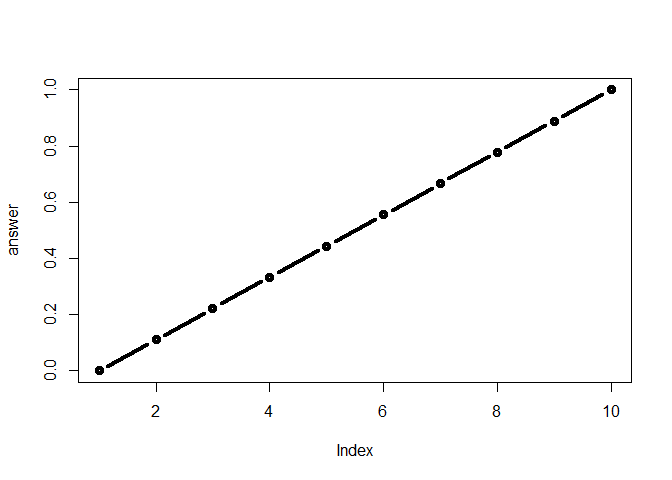

Class6 R Functions
================
Matt Maxwell
January 25, 2019

R Markdown
----------

Insert R code and run with green arrow in created section of R code

``` r
file1 <-"https://bioboot.github.io/bggn213_S18/class-material/test1.txt"
data1 <- read.table(file1, header = T, sep = ",")
data1
```

    ##   Col1 Col2 Col3
    ## 1    1    2    3
    ## 2    4    5    6
    ## 3    7    8    9
    ## 4    a    b    c

``` r
file2 <- "https://bioboot.github.io/bggn213_S18/class-material/test2.txt"
data2 <- read.table(file2, header = T, sep = "\t")
data2
```

    ##   Col1.Col2.Col3
    ## 1          1$2$3
    ## 2          4$5$6
    ## 3          7$8$9
    ## 4          a$b$c

R Functions
-----------

My first function

``` r
add <- function(x, y=1) {
 # Sum the input x and y
 x + y
}
```

Hit green arrow on function to create function before using it

Lets use the **add()** function

``` r
add(x=1, y=4)
```

    ## [1] 5

``` r
add(1, 4)
```

    ## [1] 5

``` r
add(1)
```

    ## [1] 2

Lets make a function to save us time for a task

``` r
rescale <- function (x) {
  rng <- range(x)
(x - rng[1]) / (rng[2] - rng[1])
}
```

``` r
rescale(1:10)
```

    ##  [1] 0.0000000 0.1111111 0.2222222 0.3333333 0.4444444 0.5555556 0.6666667
    ##  [8] 0.7777778 0.8888889 1.0000000

How would you get your function to work here.

``` r
rescale( c(1,2,NA,3,10))
```

    ## [1] NA NA NA NA NA

``` r
rescale2 <- function (x) {
  rng <- range(x, na.rm = TRUE)
(x - rng[1]) / (rng[2] - rng[1])
}
```

``` r
#rescale2( c(1,2,NA,3,10) )
```

``` r
rescale3 <- function(x, na.rm=TRUE, plot=TRUE) {
 if(na.rm) {
 rng <-range(x, na.rm=na.rm)
 } else {
 rng <-range(x)
 }
 print("Hello")
 answer <- (x - rng[1]) / (rng[2] - rng[1])
 print("is it me you are looking for?")
 if(plot) {
 plot(answer, typ="b", lwd=4)
   print("please don't ever sing again")
 }
 print("I can see it in ...")
}
```

``` r
rescale3(1:10, plot = TRUE)
```

    ## [1] "Hello"
    ## [1] "is it me you are looking for?"



    ## [1] "please don't ever sing again"
    ## [1] "I can see it in ..."

``` r
library("bio3d")
```

``` r
pdb <- read.pdb("1hbs")
```

    ##   Note: Accessing on-line PDB file

``` r
pdb
```

    ## 
    ##  Call:  read.pdb(file = "1hbs")
    ## 
    ##    Total Models#: 1
    ##      Total Atoms#: 9104,  XYZs#: 27312  Chains#: 8  (values: A B C D E F G H)
    ## 
    ##      Protein Atoms#: 8760  (residues/Calpha atoms#: 1148)
    ##      Nucleic acid Atoms#: 0  (residues/phosphate atoms#: 0)
    ## 
    ##      Non-protein/nucleic Atoms#: 344  (residues: 8)
    ##      Non-protein/nucleic resid values: [ HEM (8) ]
    ## 
    ##    Protein sequence:
    ##       VLSPADKTNVKAAWGKVGAHAGEYGAEALERMFLSFPTTKTYFPHFDLSHGSAQVKGHGK
    ##       KVADALTNAVAHVDDMPNALSALSDLHAHKLRVDPVNFKLLSHCLLVTLAAHLPAEFTPA
    ##       VHASLDKFLASVSTVLTSKYRVHLTPVEKSAVTALWGKVNVDEVGGEALGRLLVVYPWTQ
    ##       RFFESFGDLSTPDAVMGNPKVKAHGKKVLGAFSDGLAHLDNLKGT...<cut>...HKYH
    ## 
    ## + attr: atom, xyz, seqres, helix, calpha,
    ##         remark, call

``` r
# Can you improve this analysis code?
library(bio3d)
s1 <- read.pdb("4AKE") # kinase with drug
```

    ##   Note: Accessing on-line PDB file

``` r
s2 <- read.pdb("1AKE") # kinase no drug
```

    ##   Note: Accessing on-line PDB file
    ##    PDB has ALT records, taking A only, rm.alt=TRUE

``` r
s3 <- read.pdb("1E4Y") # kinase with drug
```

    ##   Note: Accessing on-line PDB file

``` r
s1.chainA <- trim.pdb(s1, chain="A", elety="CA")
s2.chainA <- trim.pdb(s2, chain="A", elety="CA")
s3.chainA <- trim.pdb(s3, chain="A", elety="CA")

s1.b <- s1.chainA$atom$b
s2.b <- s2.chainA$atom$b
s3.b <- s3.chainA$atom$b

plotb3(s1.b, sse=s1.chainA, typ="l", ylab="Bfactor")
```


``` r
plotb3(s2.b, sse=s2.chainA, typ="l", ylab="Bfactor")
```


``` r
plotb3(s3.b, sse=s3.chainA, typ="l", ylab="Bfactor")
```


``` r
s1
```

    ## 
    ##  Call:  read.pdb(file = "4AKE")
    ## 
    ##    Total Models#: 1
    ##      Total Atoms#: 3459,  XYZs#: 10377  Chains#: 2  (values: A B)
    ## 
    ##      Protein Atoms#: 3312  (residues/Calpha atoms#: 428)
    ##      Nucleic acid Atoms#: 0  (residues/phosphate atoms#: 0)
    ## 
    ##      Non-protein/nucleic Atoms#: 147  (residues: 147)
    ##      Non-protein/nucleic resid values: [ HOH (147) ]
    ## 
    ##    Protein sequence:
    ##       MRIILLGAPGAGKGTQAQFIMEKYGIPQISTGDMLRAAVKSGSELGKQAKDIMDAGKLVT
    ##       DELVIALVKERIAQEDCRNGFLLDGFPRTIPQADAMKEAGINVDYVLEFDVPDELIVDRI
    ##       VGRRVHAPSGRVYHVKFNPPKVEGKDDVTGEELTTRKDDQEETVRKRLVEYHQMTAPLIG
    ##       YYSKEAEAGNTKYAKVDGTKPVAEVRADLEKILGMRIILLGAPGA...<cut>...KILG
    ## 
    ## + attr: atom, xyz, seqres, helix, sheet,
    ##         calpha, remark, call

``` r
hc <- hclust( dist( rbind(s1.b, s2.b, s3.b) ) )
```

``` r
plot(hc)
```


optimize the code above by making a function, want it to work on large list of proteins. think specific optimization is needed in the read.pdb first section.

read\_structures &lt;- structure()

This is an R Markdown document. Markdown is a simple formatting syntax for authoring HTML, PDF, and MS Word documents. For more details on using R Markdown see <http://rmarkdown.rstudio.com>.

When you click the **Knit** button a document will be generated that includes both content as well as the output of any embedded R code chunks within the document. You can embed an R code chunk like this:

``` r
summary(cars)
```

    ##      speed           dist       
    ##  Min.   : 4.0   Min.   :  2.00  
    ##  1st Qu.:12.0   1st Qu.: 26.00  
    ##  Median :15.0   Median : 36.00  
    ##  Mean   :15.4   Mean   : 42.98  
    ##  3rd Qu.:19.0   3rd Qu.: 56.00  
    ##  Max.   :25.0   Max.   :120.00

Including Plots
---------------

You can also embed plots, for example:


Note that the `echo = FALSE` parameter was added to the code chunk to prevent printing of the R code that generated the plot.
