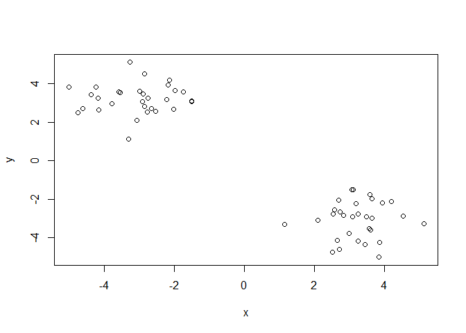

Class 08 Machine Learning Intro
================
Matt Maxwell
February 6, 2019

Clustering
----------

kmeans first play

``` r
tmp <- c(rnorm(30,-3), rnorm(30,3))

x <- cbind(x=tmp, y=rev(tmp))
plot(x)
```



``` r
# k-means algorithm to analyze x (data set) with 3 centers, run 20 times (nstart)
km <- kmeans(x, centers= 2, nstart= 20)
kmeans(x, centers= 2, nstart= 20)
```

    ## K-means clustering with 2 clusters of sizes 30, 30
    ## 
    ## Cluster means:
    ##           x         y
    ## 1 -2.849543  2.901132
    ## 2  2.901132 -2.849543
    ## 
    ## Clustering vector:
    ##  [1] 1 1 1 1 1 1 1 1 1 1 1 1 1 1 1 1 1 1 1 1 1 1 1 1 1 1 1 1 1 1 2 2 2 2 2
    ## [36] 2 2 2 2 2 2 2 2 2 2 2 2 2 2 2 2 2 2 2 2 2 2 2 2 2
    ## 
    ## Within cluster sum of squares by cluster:
    ## [1] 63.10511 63.10511
    ##  (between_SS / total_SS =  88.7 %)
    ## 
    ## Available components:
    ## 
    ## [1] "cluster"      "centers"      "totss"        "withinss"    
    ## [5] "tot.withinss" "betweenss"    "size"         "iter"        
    ## [9] "ifault"

size of clusters -- accessing list with dolla sign

``` r
km$size
```

    ## [1] 30 30

``` r
plot(x, col=km$cluster)
points(km$centers, col="blue", pch=15, cex=1)
```


Hierachical clustering
======================

``` r
# as the Euclidean distance between observations
dist_matrix <- dist(x)
# The hclust() function returns a hierarchical
# clustering model
hc <- hclust(d = dist_matrix)
# the print method is not so useful here
hc
```

    ## 
    ## Call:
    ## hclust(d = dist_matrix)
    ## 
    ## Cluster method   : complete 
    ## Distance         : euclidean 
    ## Number of objects: 60

``` r
plot(hc)
abline(h=6, col="red")
```


``` r
grp2 <- cutree(hc, h=6)
```

``` r
plot(x, col=grp2)
```


Cut into K groups, k equals number

``` r
cutree(hc, k=2)
```

    ##  [1] 1 1 1 1 1 1 1 1 1 1 1 1 1 1 1 1 1 1 1 1 1 1 1 1 1 1 1 1 1 1 2 2 2 2 2
    ## [36] 2 2 2 2 2 2 2 2 2 2 2 2 2 2 2 2 2 2 2 2 2 2 2 2 2

``` r
plot(hc)
abline(h=6, col="red")
```


``` r
# Using different hierarchical clustering methods
d <- dist_matrix

hc.complete <- hclust(d, method="complete")
plot(hc.complete)
```


``` r
hc.average <- hclust(d, method="average")
plot(hc.average)
```


``` r
hc.single <- hclust(d, method="single")
plot(hc.single)
```


Made up overlapping data - abit more real life like :)

``` r
# Step 1. Generate some example data for clustering
x <- rbind(
 matrix(rnorm(100, mean=0, sd = 0.3), ncol = 2), # c1
 matrix(rnorm(100, mean = 1, sd = 0.3), ncol = 2), # c2
 matrix(c(rnorm(50, mean = 1, sd = 0.3), # c3
 rnorm(50, mean = 0, sd = 0.3)), ncol = 2))
colnames(x) <- c("x", "y")
# Step 2. Plot the data without clustering
plot(x)
```


``` r
# Step 3. Generate colors for known clusters
# (just so we can compare to hclust results)
col <- as.factor( rep(c("c1","c2","c3"), each=50) )
plot(x, col=col)
```


Q. Use the dist(), hclust(), plot() and cutree() functions to return 2 and 3 clusters Q. How does this compare to your known 'col' groups?

``` r
##read this hiearchal function from inside out (dist, hclust, etc)
hc <- hclust(dist(x))
plot(hc)
```


``` r
grps <- cutree(hc, k=3)
plot(x, col=grps)
```


Principal component analysis is a reduction technique to determine similarities and group items.

Let's load some data for PCA

``` r
mydata <- read.csv("https://tinyurl.com/expression-CSV",
 row.names=1)
head(mydata) 
```

    ##        wt1 wt2  wt3  wt4 wt5 ko1 ko2 ko3 ko4 ko5
    ## gene1  439 458  408  429 420  90  88  86  90  93
    ## gene2  219 200  204  210 187 427 423 434 433 426
    ## gene3 1006 989 1030 1017 973 252 237 238 226 210
    ## gene4  783 792  829  856 760 849 856 835 885 894
    ## gene5  181 249  204  244 225 277 305 272 270 279
    ## gene6  460 502  491  491 493 612 594 577 618 638

How to do PCA in R
==================

``` r
##lets do PCA with prcomp
pca <- prcomp(t(mydata), scale = TRUE)
summary(pca)
```

    ## Importance of components:
    ##                           PC1    PC2     PC3     PC4     PC5     PC6
    ## Standard deviation     9.6237 1.5198 1.05787 1.05203 0.88062 0.82545
    ## Proportion of Variance 0.9262 0.0231 0.01119 0.01107 0.00775 0.00681
    ## Cumulative Proportion  0.9262 0.9493 0.96045 0.97152 0.97928 0.98609
    ##                            PC7     PC8     PC9      PC10
    ## Standard deviation     0.80111 0.62065 0.60342 3.348e-15
    ## Proportion of Variance 0.00642 0.00385 0.00364 0.000e+00
    ## Cumulative Proportion  0.99251 0.99636 1.00000 1.000e+00

``` r
plot(pca)
```


``` r
attributes(pca)
```

    ## $names
    ## [1] "sdev"     "rotation" "center"   "scale"    "x"       
    ## 
    ## $class
    ## [1] "prcomp"

``` r
pca <- prcomp(t(mydata), scale = TRUE)
## basic PC1 vs PC2 2D plot
plot(pca$x[,1], pca$x[,2], xlab= "PC1", ylab = "PC2")
```


``` r
## variance captured per PC
pca.var <- pca$sdev^2
pca.var.per <-round(pca.var/sum(pca.var)*100, 1)
```

PCA for Ireland food consumption
================================

``` r
#read data
ukfoods <- read.csv("UK_foods.csv")
```
