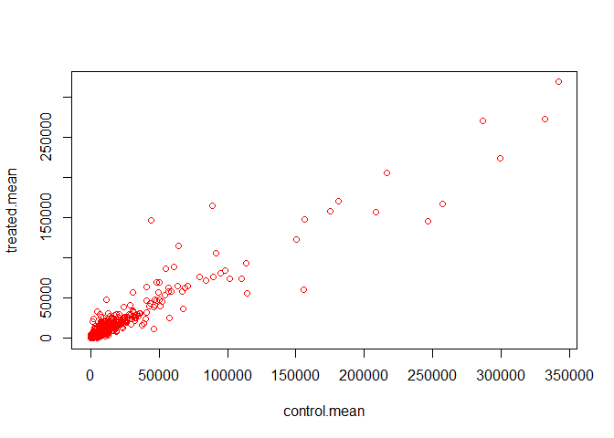
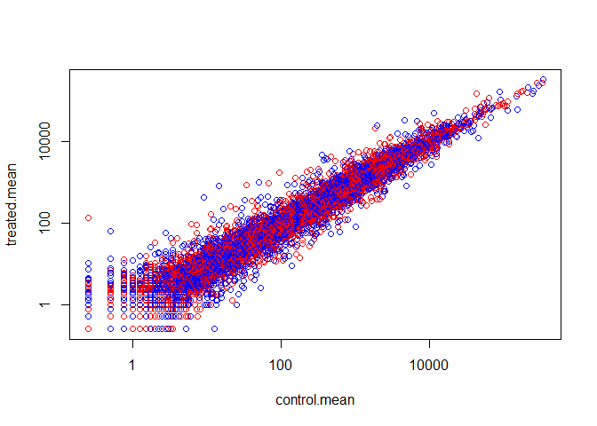
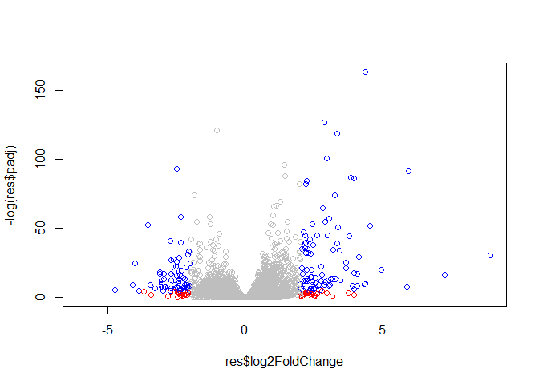
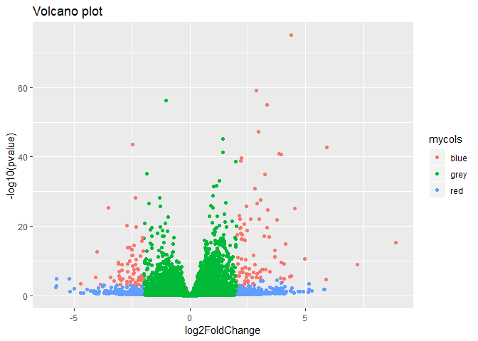

Class 14 Transcriptomics and Analysis of RNA-seq Data
================

Study profiling ASM cell lines treated with dexamethasone focused in on gene CRISPLD2

RNA seq Analysis
================

Import countData and colData
============================

``` r
counts <- read.csv("Data/airway_scaledcounts.csv", stringsAsFactors = FALSE)
metadata <-  read.csv("Data/airway_metadata.csv", stringsAsFactors = FALSE)
```

Check the data

``` r
head(counts)
```

    ##           ensgene SRR1039508 SRR1039509 SRR1039512 SRR1039513 SRR1039516
    ## 1 ENSG00000000003        723        486        904        445       1170
    ## 2 ENSG00000000005          0          0          0          0          0
    ## 3 ENSG00000000419        467        523        616        371        582
    ## 4 ENSG00000000457        347        258        364        237        318
    ## 5 ENSG00000000460         96         81         73         66        118
    ## 6 ENSG00000000938          0          0          1          0          2
    ##   SRR1039517 SRR1039520 SRR1039521
    ## 1       1097        806        604
    ## 2          0          0          0
    ## 3        781        417        509
    ## 4        447        330        324
    ## 5         94        102         74
    ## 6          0          0          0

``` r
head(metadata)
```

    ##           id     dex celltype     geo_id
    ## 1 SRR1039508 control   N61311 GSM1275862
    ## 2 SRR1039509 treated   N61311 GSM1275863
    ## 3 SRR1039512 control  N052611 GSM1275866
    ## 4 SRR1039513 treated  N052611 GSM1275867
    ## 5 SRR1039516 control  N080611 GSM1275870
    ## 6 SRR1039517 treated  N080611 GSM1275871

``` r
View(metadata)
```

``` r
nrow(counts)
```

    ## [1] 38694

``` r
ncol(counts)
```

    ## [1] 9

Check for metadata to counts correspondence

``` r
all( metadata$id == colnames(counts)[-1] )
```

    ## [1] TRUE

Our header ensgene is being counted as a column. use \[-1\] following colnames(counts) to match up our columns.

Control counts
==============

this labels control samples counts with Ensemble gene identifiers
=================================================================

``` r
control.ids <- metadata$id[metadata[,"dex"]=="control"]
control <- counts[,control.ids]
rownames(control) <- counts$ensgene
head(control)
```

    ##                 SRR1039508 SRR1039512 SRR1039516 SRR1039520
    ## ENSG00000000003        723        904       1170        806
    ## ENSG00000000005          0          0          0          0
    ## ENSG00000000419        467        616        582        417
    ## ENSG00000000457        347        364        318        330
    ## ENSG00000000460         96         73        118        102
    ## ENSG00000000938          0          1          2          0

Treated counts
==============

``` r
treated.ids <- metadata$id[metadata[,"dex"] =="treated"]
treated <- counts[,treated.ids]
rownames(treated) <- counts$ensgene
head(treated)
```

    ##                 SRR1039509 SRR1039513 SRR1039517 SRR1039521
    ## ENSG00000000003        486        445       1097        604
    ## ENSG00000000005          0          0          0          0
    ## ENSG00000000419        523        371        781        509
    ## ENSG00000000457        258        237        447        324
    ## ENSG00000000460         81         66         94         74
    ## ENSG00000000938          0          0          0          0

Lets get the means for control and treated groups for all our genes.

``` r
control.mean <- rowMeans(control)
head(control.mean)
```

    ## ENSG00000000003 ENSG00000000005 ENSG00000000419 ENSG00000000457 
    ##          900.75            0.00          520.50          339.75 
    ## ENSG00000000460 ENSG00000000938 
    ##           97.25            0.75

``` r
treated.mean <- rowMeans(treated)
head(treated.mean)
```

    ## ENSG00000000003 ENSG00000000005 ENSG00000000419 ENSG00000000457 
    ##          658.00            0.00          546.00          316.50 
    ## ENSG00000000460 ENSG00000000938 
    ##           78.75            0.00

Get mean count value for each gene for both groups. Use data.frame() functuion for making this pretty

``` r
meancounts <- data.frame(control.mean, treated.mean)
head(meancounts)
```

    ##                 control.mean treated.mean
    ## ENSG00000000003       900.75       658.00
    ## ENSG00000000005         0.00         0.00
    ## ENSG00000000419       520.50       546.00
    ## ENSG00000000457       339.75       316.50
    ## ENSG00000000460        97.25        78.75
    ## ENSG00000000938         0.75         0.00

``` r
colSums(meancounts)
```

    ## control.mean treated.mean 
    ##     23005324     22196524

``` r
plot(meancounts, col=c("red"))
```



Use log scale for x & y axis!
=============================

``` r
plot(meancounts, col=c("red", "blue"), log="xy")
```

    ## Warning in xy.coords(x, y, xlabel, ylabel, log): 15032 x values <= 0
    ## omitted from logarithmic plot

    ## Warning in xy.coords(x, y, xlabel, ylabel, log): 15281 y values <= 0
    ## omitted from logarithmic plot

 \#Create a Log2FC column in meancounts to examine fold change of treated samples relative to control.

``` r
meancounts$log2fc <- log2(meancounts$treated.mean/meancounts$control.mean)
head(meancounts)
```

    ##                 control.mean treated.mean      log2fc
    ## ENSG00000000003       900.75       658.00 -0.45303916
    ## ENSG00000000005         0.00         0.00         NaN
    ## ENSG00000000419       520.50       546.00  0.06900279
    ## ENSG00000000457       339.75       316.50 -0.10226805
    ## ENSG00000000460        97.25        78.75 -0.30441833
    ## ENSG00000000938         0.75         0.00        -Inf

The negative value means they are below the 45˚ line if we look at the graph. It means when the cell is treated, the gene has a lower value than in control. -Inf means it's trying to log O. We want to filter all the 0 values.

Also, let's call our corrected meancounts "mycounts"

``` r
zero.vals <- which(meancounts[,1:2]==0, arr.ind=TRUE)

to.rm <- unique(zero.vals[,1])
mycounts <- meancounts[-to.rm,]
head(mycounts)
```

    ##                 control.mean treated.mean      log2fc
    ## ENSG00000000003       900.75       658.00 -0.45303916
    ## ENSG00000000419       520.50       546.00  0.06900279
    ## ENSG00000000457       339.75       316.50 -0.10226805
    ## ENSG00000000460        97.25        78.75 -0.30441833
    ## ENSG00000000971      5219.00      6687.50  0.35769358
    ## ENSG00000001036      2327.00      1785.75 -0.38194109

arr.ind returns results as an array

``` r
toy <- c(1,2,0,4,0)
which(toy==0)
```

    ## [1] 3 5

``` r
newtoy <- cbind(toy,toy)
which(newtoy==0, arr.ind = TRUE)
```

    ##      row col
    ## [1,]   3   1
    ## [2,]   5   1
    ## [3,]   3   2
    ## [4,]   5   2

``` r
unique( which(newtoy==0, arr.ind = TRUE)[,1])
```

    ## [1] 3 5

mycounts has corrected Logfold change column.
=============================================

Now that we have cleaned up the data let's set up some threshold to help us furthur characterize the darta. It's common to set the threshold of greater than 2 or less than -2.

``` r
up.ind <- mycounts$log2fc > 2
down.ind <- mycounts$log2fc < (-2)
```

250 upregulated genes.

``` r
sum(up.ind)
```

    ## [1] 250

367 downregulated genes

``` r
sum(down.ind)
```

    ## [1] 367

Let's add anotation data from Ensemble
--------------------------------------

``` r
anno <- read.csv("Data/annotables_grch38.csv")
head(anno)
```

    ##           ensgene entrez   symbol chr     start       end strand
    ## 1 ENSG00000000003   7105   TSPAN6   X 100627109 100639991     -1
    ## 2 ENSG00000000005  64102     TNMD   X 100584802 100599885      1
    ## 3 ENSG00000000419   8813     DPM1  20  50934867  50958555     -1
    ## 4 ENSG00000000457  57147    SCYL3   1 169849631 169894267     -1
    ## 5 ENSG00000000460  55732 C1orf112   1 169662007 169854080      1
    ## 6 ENSG00000000938   2268      FGR   1  27612064  27635277     -1
    ##          biotype
    ## 1 protein_coding
    ## 2 protein_coding
    ## 3 protein_coding
    ## 4 protein_coding
    ## 5 protein_coding
    ## 6 protein_coding
    ##                                                                                                  description
    ## 1                                                          tetraspanin 6 [Source:HGNC Symbol;Acc:HGNC:11858]
    ## 2                                                            tenomodulin [Source:HGNC Symbol;Acc:HGNC:17757]
    ## 3 dolichyl-phosphate mannosyltransferase polypeptide 1, catalytic subunit [Source:HGNC Symbol;Acc:HGNC:3005]
    ## 4                                               SCY1-like, kinase-like 3 [Source:HGNC Symbol;Acc:HGNC:19285]
    ## 5                                    chromosome 1 open reading frame 112 [Source:HGNC Symbol;Acc:HGNC:25565]
    ## 6                          FGR proto-oncogene, Src family tyrosine kinase [Source:HGNC Symbol;Acc:HGNC:3697]

``` r
dim(anno)
```

    ## [1] 66531     9

Let's try-out the **merge()** function to add the annotation data to our **mycounts** (i.e., gene names to the ensemble identifiers)
------------------------------------------------------------------------------------------------------------------------------------

``` r
head(mycounts)
```

    ##                 control.mean treated.mean      log2fc
    ## ENSG00000000003       900.75       658.00 -0.45303916
    ## ENSG00000000419       520.50       546.00  0.06900279
    ## ENSG00000000457       339.75       316.50 -0.10226805
    ## ENSG00000000460        97.25        78.75 -0.30441833
    ## ENSG00000000971      5219.00      6687.50  0.35769358
    ## ENSG00000001036      2327.00      1785.75 -0.38194109

``` r
mycounts.anno <- merge(x=mycounts, y=anno, by.x="row.names", by.y="ensgene")
head(mycounts.anno)
```

    ##         Row.names control.mean treated.mean      log2fc entrez   symbol
    ## 1 ENSG00000000003       900.75       658.00 -0.45303916   7105   TSPAN6
    ## 2 ENSG00000000419       520.50       546.00  0.06900279   8813     DPM1
    ## 3 ENSG00000000457       339.75       316.50 -0.10226805  57147    SCYL3
    ## 4 ENSG00000000460        97.25        78.75 -0.30441833  55732 C1orf112
    ## 5 ENSG00000000971      5219.00      6687.50  0.35769358   3075      CFH
    ## 6 ENSG00000001036      2327.00      1785.75 -0.38194109   2519    FUCA2
    ##   chr     start       end strand        biotype
    ## 1   X 100627109 100639991     -1 protein_coding
    ## 2  20  50934867  50958555     -1 protein_coding
    ## 3   1 169849631 169894267     -1 protein_coding
    ## 4   1 169662007 169854080      1 protein_coding
    ## 5   1 196651878 196747504      1 protein_coding
    ## 6   6 143494811 143511690     -1 protein_coding
    ##                                                                                                  description
    ## 1                                                          tetraspanin 6 [Source:HGNC Symbol;Acc:HGNC:11858]
    ## 2 dolichyl-phosphate mannosyltransferase polypeptide 1, catalytic subunit [Source:HGNC Symbol;Acc:HGNC:3005]
    ## 3                                               SCY1-like, kinase-like 3 [Source:HGNC Symbol;Acc:HGNC:19285]
    ## 4                                    chromosome 1 open reading frame 112 [Source:HGNC Symbol;Acc:HGNC:25565]
    ## 5                                                     complement factor H [Source:HGNC Symbol;Acc:HGNC:4883]
    ## 6                                          fucosidase, alpha-L- 2, plasma [Source:HGNC Symbol;Acc:HGNC:4008]

``` r
source("http://bioconductor.org/biocLite.R")
```

    ## Bioconductor version 3.7 (BiocInstaller 1.30.0), ?biocLite for help

    ## A newer version of Bioconductor is available for this version of R,
    ##   ?BiocUpgrade for help

``` r
biocLite("AnnotationDbi")
```

    ## BioC_mirror: https://bioconductor.org

    ## Using Bioconductor 3.7 (BiocInstaller 1.30.0), R 3.5.2 (2018-12-20).

    ## Installing package(s) 'AnnotationDbi'

    ## package 'AnnotationDbi' successfully unpacked and MD5 sums checked
    ## 
    ## The downloaded binary packages are in
    ##  C:\Users\mattm\AppData\Local\Temp\Rtmpyakekw\downloaded_packages

    ## installation path not writeable, unable to update packages: class,
    ##   codetools, Matrix, mgcv

    ## Old packages: 'caTools', 'formatR', 'glue', 'knitr', 'openssl',
    ##   'processx', 'RcppArmadillo', 'RCurl', 'rgl', 'rmarkdown', 'stringi',
    ##   'sys', 'tinytex', 'XML'

``` r
source("http://bioconductor.org/biocLite.R")
```

    ## Bioconductor version 3.7 (BiocInstaller 1.30.0), ?biocLite for help

    ## A newer version of Bioconductor is available for this version of R,
    ##   ?BiocUpgrade for help

``` r
biocLite("org.Hs.eg.db")
```

    ## BioC_mirror: https://bioconductor.org

    ## Using Bioconductor 3.7 (BiocInstaller 1.30.0), R 3.5.2 (2018-12-20).

    ## Installing package(s) 'org.Hs.eg.db'

    ## installing the source package 'org.Hs.eg.db'

    ## installation path not writeable, unable to update packages: class,
    ##   codetools, Matrix, mgcv

    ## Old packages: 'caTools', 'formatR', 'glue', 'knitr', 'openssl',
    ##   'processx', 'RcppArmadillo', 'RCurl', 'rgl', 'rmarkdown', 'stringi',
    ##   'sys', 'tinytex', 'XML'

``` r
library(org.Hs.eg.db)
```

    ## Loading required package: AnnotationDbi

    ## Loading required package: stats4

    ## Loading required package: BiocGenerics

    ## Loading required package: parallel

    ## 
    ## Attaching package: 'BiocGenerics'

    ## The following objects are masked from 'package:parallel':
    ## 
    ##     clusterApply, clusterApplyLB, clusterCall, clusterEvalQ,
    ##     clusterExport, clusterMap, parApply, parCapply, parLapply,
    ##     parLapplyLB, parRapply, parSapply, parSapplyLB

    ## The following objects are masked from 'package:stats':
    ## 
    ##     IQR, mad, sd, var, xtabs

    ## The following objects are masked from 'package:base':
    ## 
    ##     anyDuplicated, append, as.data.frame, basename, cbind,
    ##     colMeans, colnames, colSums, dirname, do.call, duplicated,
    ##     eval, evalq, Filter, Find, get, grep, grepl, intersect,
    ##     is.unsorted, lapply, lengths, Map, mapply, match, mget, order,
    ##     paste, pmax, pmax.int, pmin, pmin.int, Position, rank, rbind,
    ##     Reduce, rowMeans, rownames, rowSums, sapply, setdiff, sort,
    ##     table, tapply, union, unique, unsplit, which, which.max,
    ##     which.min

    ## Loading required package: Biobase

    ## Welcome to Bioconductor
    ## 
    ##     Vignettes contain introductory material; view with
    ##     'browseVignettes()'. To cite Bioconductor, see
    ##     'citation("Biobase")', and for packages 'citation("pkgname")'.

    ## Loading required package: IRanges

    ## Loading required package: S4Vectors

    ## 
    ## Attaching package: 'S4Vectors'

    ## The following object is masked from 'package:base':
    ## 
    ##     expand.grid

    ## 
    ## Attaching package: 'IRanges'

    ## The following object is masked from 'package:grDevices':
    ## 
    ##     windows

    ## 

``` r
columns(org.Hs.eg.db)
```

    ##  [1] "ACCNUM"       "ALIAS"        "ENSEMBL"      "ENSEMBLPROT" 
    ##  [5] "ENSEMBLTRANS" "ENTREZID"     "ENZYME"       "EVIDENCE"    
    ##  [9] "EVIDENCEALL"  "GENENAME"     "GO"           "GOALL"       
    ## [13] "IPI"          "MAP"          "OMIM"         "ONTOLOGY"    
    ## [17] "ONTOLOGYALL"  "PATH"         "PFAM"         "PMID"        
    ## [21] "PROSITE"      "REFSEQ"       "SYMBOL"       "UCSCKG"      
    ## [25] "UNIGENE"      "UNIPROT"

Add columns for gene symbol, entrez id, and uniprot ID.
=======================================================

``` r
mycounts$symbol <- mapIds(org.Hs.eg.db,
                     keys=row.names(mycounts),
                     column="SYMBOL",
                     keytype="ENSEMBL",
                     multiVals="first")
```

    ## 'select()' returned 1:many mapping between keys and columns

``` r
mycounts$entrez <- mapIds(org.Hs.eg.db,
                     keys=row.names(mycounts),
                     column="ENTREZID",
                     keytype="ENSEMBL",
                     multiVals="first")
```

    ## 'select()' returned 1:many mapping between keys and columns

``` r
mycounts$uniprot <- mapIds(org.Hs.eg.db,
                                    keys=row.names(mycounts),
                                    column="UNIPROT",
                                    keytype="ENSEMBL",
                                    multiVals="first")
```

    ## 'select()' returned 1:many mapping between keys and columns

``` r
head(mycounts)
```

    ##                 control.mean treated.mean      log2fc   symbol entrez
    ## ENSG00000000003       900.75       658.00 -0.45303916   TSPAN6   7105
    ## ENSG00000000419       520.50       546.00  0.06900279     DPM1   8813
    ## ENSG00000000457       339.75       316.50 -0.10226805    SCYL3  57147
    ## ENSG00000000460        97.25        78.75 -0.30441833 C1orf112  55732
    ## ENSG00000000971      5219.00      6687.50  0.35769358      CFH   3075
    ## ENSG00000001036      2327.00      1785.75 -0.38194109    FUCA2   2519
    ##                    uniprot
    ## ENSG00000000003 A0A024RCI0
    ## ENSG00000000419     O60762
    ## ENSG00000000457     Q8IZE3
    ## ENSG00000000460 A0A024R922
    ## ENSG00000000971 A0A024R962
    ## ENSG00000001036     Q9BTY2

DESeq2 Analysi
--------------

``` r
library(DESeq2)
```

    ## Loading required package: GenomicRanges

    ## Loading required package: GenomeInfoDb

    ## Loading required package: SummarizedExperiment

    ## Loading required package: DelayedArray

    ## Loading required package: matrixStats

    ## 
    ## Attaching package: 'matrixStats'

    ## The following objects are masked from 'package:Biobase':
    ## 
    ##     anyMissing, rowMedians

    ## Loading required package: BiocParallel

    ## 
    ## Attaching package: 'DelayedArray'

    ## The following objects are masked from 'package:matrixStats':
    ## 
    ##     colMaxs, colMins, colRanges, rowMaxs, rowMins, rowRanges

    ## The following objects are masked from 'package:base':
    ## 
    ##     aperm, apply

DESeq2 uses a special object called DESeqDataSet which is composed from the count data, the metadata and the experimental design. It will also store the data in the object.

``` r
dds <- DESeqDataSetFromMatrix(countData = counts,
                              colData = metadata,
                              design= ~dex,
                              tidy= T)
```

    ## converting counts to integer mode

    ## Warning in DESeqDataSet(se, design = design, ignoreRank): some variables in
    ## design formula are characters, converting to factors

``` r
dds
```

    ## class: DESeqDataSet 
    ## dim: 38694 8 
    ## metadata(1): version
    ## assays(1): counts
    ## rownames(38694): ENSG00000000003 ENSG00000000005 ...
    ##   ENSG00000283120 ENSG00000283123
    ## rowData names(0):
    ## colnames(8): SRR1039508 SRR1039509 ... SRR1039520 SRR1039521
    ## colData names(4): id dex celltype geo_id

Run DESeq Analysis

``` r
dds <- DESeq(dds)
```

    ## estimating size factors

    ## estimating dispersions

    ## gene-wise dispersion estimates

    ## mean-dispersion relationship

    ## final dispersion estimates

    ## fitting model and testing

Get results from DESeq Analysi

``` r
res <- results(dds)
res
```

    ## log2 fold change (MLE): dex treated vs control 
    ## Wald test p-value: dex treated vs control 
    ## DataFrame with 38694 rows and 6 columns
    ##                          baseMean     log2FoldChange             lfcSE
    ##                         <numeric>          <numeric>         <numeric>
    ## ENSG00000000003  747.194195359907  -0.35070296228142 0.168242083227575
    ## ENSG00000000005                 0                 NA                NA
    ## ENSG00000000419  520.134160051965  0.206107283859668 0.101041504451637
    ## ENSG00000000457  322.664843927049 0.0245270113332215 0.145133863749003
    ## ENSG00000000460   87.682625164828 -0.147142630021569  0.25699544204927
    ## ...                           ...                ...               ...
    ## ENSG00000283115                 0                 NA                NA
    ## ENSG00000283116                 0                 NA                NA
    ## ENSG00000283119                 0                 NA                NA
    ## ENSG00000283120 0.974916032393564 -0.668250141508022  1.69441251902782
    ## ENSG00000283123                 0                 NA                NA
    ##                               stat             pvalue              padj
    ##                          <numeric>          <numeric>         <numeric>
    ## ENSG00000000003  -2.08451390730246 0.0371134465299012 0.163017154203989
    ## ENSG00000000005                 NA                 NA                NA
    ## ENSG00000000419   2.03982793979795 0.0413674659663301 0.175936611081177
    ## ENSG00000000457  0.168995785681273  0.865799956262632 0.961682459669788
    ## ENSG00000000460  -0.57254957071713  0.566949713034425 0.815805192488045
    ## ...                            ...                ...               ...
    ## ENSG00000283115                 NA                 NA                NA
    ## ENSG00000283116                 NA                 NA                NA
    ## ENSG00000283119                 NA                 NA                NA
    ## ENSG00000283120 -0.394384563383323  0.693297138831059                NA
    ## ENSG00000283123                 NA                 NA                NA

``` r
summary(res)
```

    ## 
    ## out of 25258 with nonzero total read count
    ## adjusted p-value < 0.1
    ## LFC > 0 (up)       : 1564, 6.2%
    ## LFC < 0 (down)     : 1188, 4.7%
    ## outliers [1]       : 142, 0.56%
    ## low counts [2]     : 9971, 39%
    ## (mean count < 10)
    ## [1] see 'cooksCutoff' argument of ?results
    ## [2] see 'independentFiltering' argument of ?results

Let's change the p value from .1 to 0.05, more stringent cutoff.

``` r
summary(res, alpha=0.05)
```

    ## 
    ## out of 25258 with nonzero total read count
    ## adjusted p-value < 0.05
    ## LFC > 0 (up)       : 1242, 4.9%
    ## LFC < 0 (down)     : 939, 3.7%
    ## outliers [1]       : 142, 0.56%
    ## low counts [2]     : 9971, 39%
    ## (mean count < 10)
    ## [1] see 'cooksCutoff' argument of ?results
    ## [2] see 'independentFiltering' argument of ?results

Volcano plots
-------------

``` r
plot(res$log2FoldChange, -log(res$padj))
```


Let's colorize the graph

ran into trouble following entrez additon to mycounts.
======================================================

``` r
mycols <- rep("grey", nrow(res))
mycols[abs(res$log2FoldChange) > 2] = "red"
subsuet.inds <- res$padj<0.01 & abs(res$log2FoldChange)>2

mycols[subsuet.inds] = "blue"
plot(res$log2FoldChange, -log(res$padj), col=mycols)
```



Let's do this in ggplot too, make some pretty graphs in ggplot.

``` r
library(ggplot2)
ggplot(as.data.frame(res), aes(log2FoldChange, -log10(pvalue), col=mycols)) + 
    geom_point() + 
    ggtitle("Volcano plot")
```

    ## Warning: Removed 13578 rows containing missing values (geom_point).



Weird. Bioconductor package not available for the latest version of R.

``` r
biocLite("EnhancedVolcano")
```

    ## BioC_mirror: https://bioconductor.org

    ## Using Bioconductor 3.7 (BiocInstaller 1.30.0), R 3.5.2 (2018-12-20).

    ## Installing package(s) 'EnhancedVolcano'

    ## Warning: package 'EnhancedVolcano' is not available (for R version 3.5.2)

    ## installation path not writeable, unable to update packages: class,
    ##   codetools, Matrix, mgcv

    ## Old packages: 'caTools', 'formatR', 'glue', 'knitr', 'openssl',
    ##   'processx', 'RcppArmadillo', 'RCurl', 'rgl', 'rmarkdown', 'stringi',
    ##   'sys', 'tinytex', 'XML'
