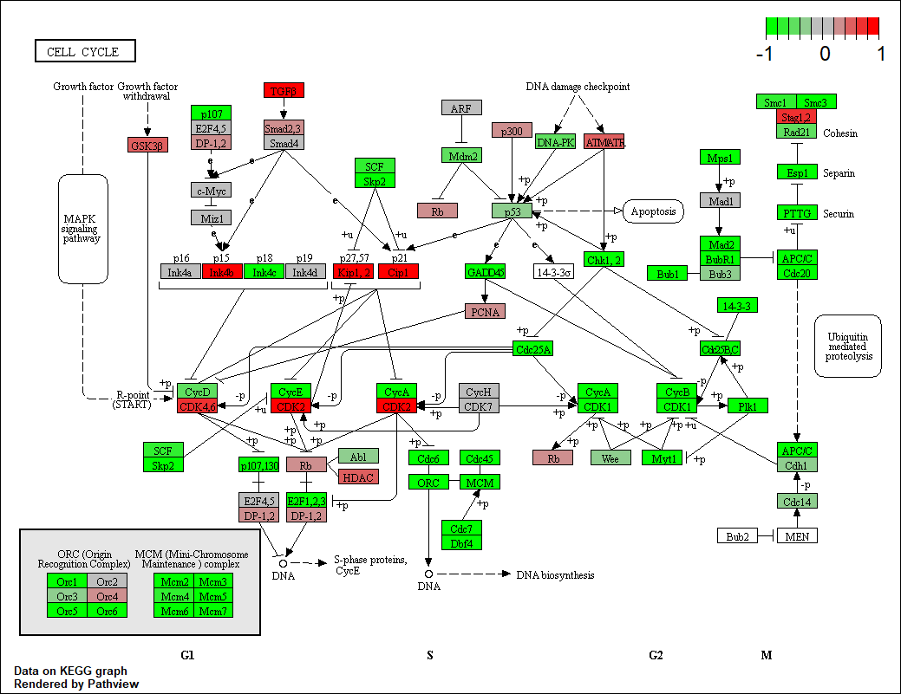

Today we'll read in our RNA seq files for a transcription factor siRNA knockdown experiment. We'll do differential expression analysis then pathway analysis.

```{r Loading DESeq2 package, message=FALSE}
library(DESeq2)
```

Import metaFile
```{r Load data files}
metaFile <- "data/GSE37704_metadata.csv"
countFile <- "data/GSE37704_featurecounts.csv"

#save metaFile formatted as a table under colData
colData =read.csv(metaFile, row.names=1)
head(colData)

```


```{r}
countData = read.csv(countFile, row.names = 1)
head(countData)
```
Dimensions of Data: --> 19808 genes (rows) and 6 experiments (columns).
```{r}
dim(countData)

```

Note we need to remove the odd first $length col
```{r}

countData <- as.matrix(countData[,-1])
head(countData)
```


```{r}
head(colData)
```

Make sure our colData and countData are matching up. DESeq2 requires this.
```{r}
all( row.names(colData) == colnames(countData) )
```


Data looks better but there are lots of zero entries in countData so let’s get rid of them as we have no data for these. These are genes that aren't giving any reads.

```{r}
inds <- rowSums(countData) !=0
inds[1:5]
```


```{r}
# Filter count data where you have 0 read count across all samples.
inds <- rowSums(countData) !=0
countData = countData[inds, ]
head(countData)
```
```{r}
dim(countData)
```

We now have `r nrow(countData)` genes remaining in our dataset. Only genes that have transcript reads.


##Running DESeq2

```{r}
dds = DESeqDataSetFromMatrix(countData=countData,
                             colData=colData,
                             design=~condition)

dds = DESeq(dds)
```


```{r}
res = results(dds)
head(res)
```

```{r}
plot(res$log2FoldChange, -log(res$padj))
```


```{r}
# Make a color vector for ALL genes in res
mycols <- rep("gray", nrow(res) )

# Color red the genes with absolute fold change above 2
mycols[ abs(res$log2FoldChange) > 2 ] <- "red"

# Color blue those with adjusted p-value less than 0.01
#  and absolute fold change more than 2
inds <- (abs(res$padj)) < .01 & (abs(res$log2FoldChange) > 2 )
mycols[ inds ] <- "blue"

plot(res$log2FoldChange, -log(res$padj), col=mycols, xlab="Log2(FoldChange)", ylab="-Log(P-value)" )


```

```{r}
head(res)
```

```{r}
library("AnnotationDbi")
library("org.Hs.eg.db")

columns(org.Hs.eg.db)
```

```{r}
res$symbol = mapIds(org.Hs.eg.db,
                    keys=row.names(res), 
                    keytype="ENSEMBL",
                    column="SYMBOL",
                    multiVals="first")

res$entrez = mapIds(org.Hs.eg.db,
                    keys=row.names(res),
                    keytype="ENSEMBL",
                    column="ENTREZID",
                    multiVals="first")

res$name =   mapIds(org.Hs.eg.db,
                    keys=row.names(res),
                    keytype="ENSEMBL",
                    column="GENENAME",
                    multiVals="first")

head(res, 10)
```

Save my results to date!
```{r save_results}
res = res[order(res$pvalue),]
write.csv(res, file = "deseq_results.csv")
```


##Pathway Analysis 

```{r eval=FALSE}
source("http://bioconductor.org/biocLite.R")
biocLite( c("pathview", "gage", "gageData") )
```

```{r}
library(pathview)
library(gage)
library(gageData)
```
Here we are going to use the gage package for pathway analysis. Once we have a list of enriched pathways, we’re going to use the pathview package to draw pathway diagrams, shading the molecules in the pathway by their degree of up/down-regulation.


```{r}
data(kegg.sets.hs)
data(sigmet.idx.hs)

# Focus on signaling and metabolic pathways only
kegg.sets.hs = kegg.sets.hs[sigmet.idx.hs]

# Examine the first 3 pathways
head(kegg.sets.hs, 3)

```


The main gage() function requires a named vector of fold changes, where the names of the values are the Entrez gene IDs.

Note that we used the mapIDs() function above to obtain Entrez gene IDs (stored in  res$entrez) and we have the fold change results from DESeq2 analysis (stored in  res$log2FoldChange).

```{r}
foldchanges = res$log2FoldChange
names(foldchanges) = res$entrez
head(foldchanges)
```


```{r}
# Get the results
keggres = gage(foldchanges, gsets=kegg.sets.hs)

```


```{r}
attributes(keggres)
```


```{r}
# Look at the first few down (less) pathways
head(keggres$less)
```


```{r}
pathview(gene.data=foldchanges, pathway.id="hsa04110")
```

If I was using regular text and wanted a [link]()




##Gene Ontology (GO)
```{r}
data(go.sets.hs)
data(go.subs.hs)

# Focus on Biological Process subset of GO
gobpsets = go.sets.hs[go.subs.hs$BP]

gobpres = gage(foldchanges, gsets=gobpsets, same.dir=TRUE)

lapply(gobpres, head)
```


```{r}
sig_genes <- res[res$padj <= 0.05 & !is.na(res$padj), "symbol"]
print(paste("Total number of significant genes:", length(sig_genes)))
```


```{r}
write.table(sig_genes, file="significant_genes.txt", row.names=FALSE, col.names=FALSE, quote=FALSE)
```


